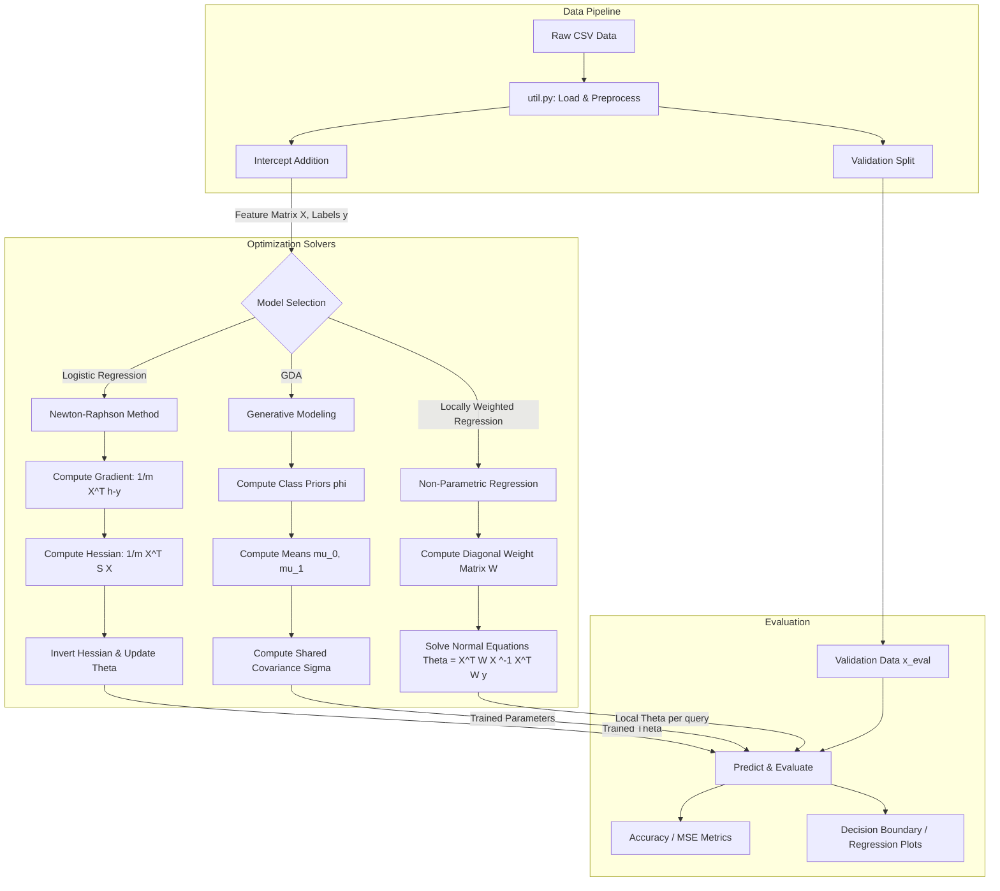

# Machine Learning from Scratch

A comprehensive collection of core machine learning algorithms implemented purely from scratch using mathematical first principles and NumPy. This project eschews high-level ML libraries (like scikit-learn) in favor of building custom optimization solvers, calculating gradients, and computing Hessians explicitly.

## Algorithms Implemented

1. **Logistic Regression with Newton's Method**
   - Implemented a Hessian-based second-order optimization solver.
   - Computes the gradient and Hessian matrix for logistic loss to achieve faster convergence than standard gradient descent.

2. **Gaussian Discriminant Analysis (GDA)**
   - Implemented a generative learning algorithm.
   - Calculates class priors, mean vectors, and the shared covariance matrix to model the probability distribution of the data.

3. **Locally Weighted Regression (LWR)**
   - Implemented a non-parametric regression model.
   - Built a custom solver for weighted least-squares utilizing diagonal weight matrices.
   - Includes hyperparameter search (tau/bandwidth sweep) with Mean Squared Error (MSE) based model selection on validation sets.

## Tech Stack
- **Language:** Python
- **Libraries:** NumPy, Matplotlib (for visualization)

## Repository Structure

```text
ML-from-Scratch/
├── data/                            # Raw datasets (CSV)
│   ├── ds1_train.csv                # (Logistic Regression + GDA)
│   ├── ds5_train.csv                # (LWR + Tau Sweep)
│   └── ...
├── src/                             # Algorithm Implementations
│   ├── main.py                      # Main entry point to run algorithms
│   ├── linear_model.py              # Base model class
│   ├── logistic_regression.py       # Logistic Regression via Newton's Method
│   ├── gaussian_discriminant.py     # Gaussian Discriminant Analysis (GDA)
│   ├── locally_weighted_reg.py      # Locally Weighted Regression (LWR)
│   ├── lwr_tau_sweep.py             # Hyperparameter bandwidth tuning
│   └── util.py                      # Data loading and plotting helpers
├── requirements.txt
└── README.md
```

## Setup & Execution

### Prerequisites
Make sure you have Python 3.8+ installed.

### Installation
Clone the repository and install dependencies:
```bash
git clone https://github.com/Ksalgotra1/ML-from-Scratch.git
cd ML-from-Scratch
pip install -r requirements.txt
```

### Running the Models
Run all algorithms at once:
```bash
cd src
python main.py
```

Or run specific problems:
```bash
python main.py 1   # Logistic Regression + GDA
python main.py 5   # Locally Weighted Regression + Tau Sweep
```

## Architecture & Optimization Flow



## Why this project?
Building these models from scratch ensures a deep mathematical understanding of how learning algorithms actually work under the hood—from matrix calculus (Hessian inversion) to probabilistic generative modeling.

---
*Created by Krishna Salgotra*
